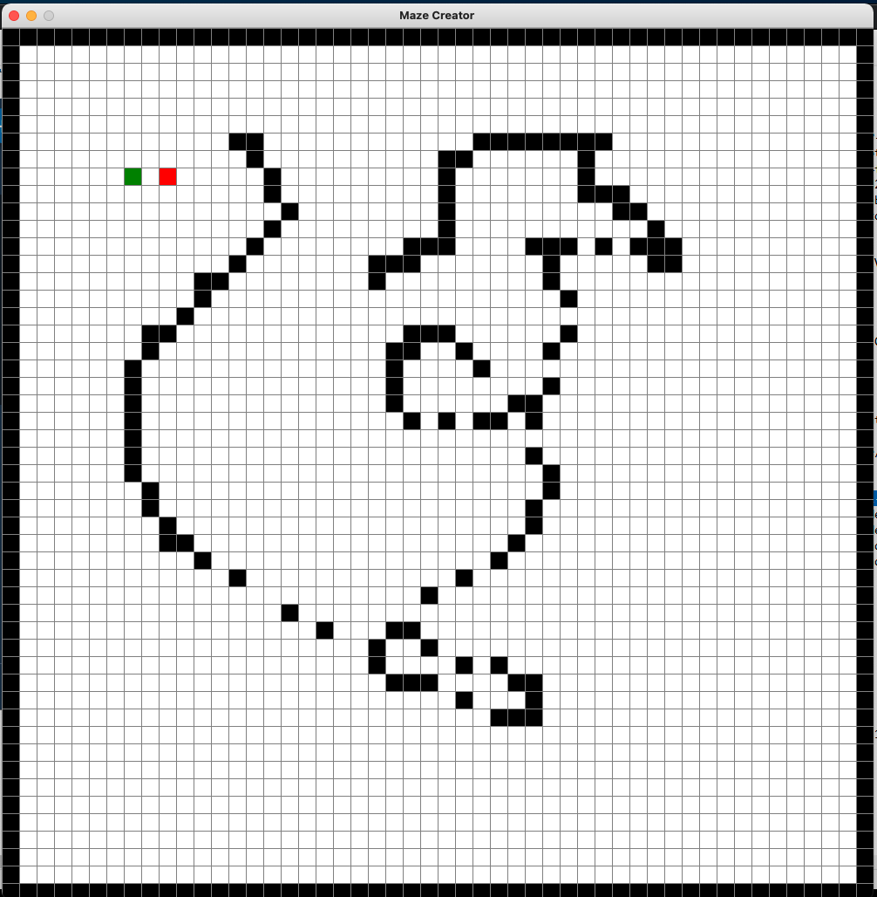

# pathfinding-dijkstra
Simple implementation of Dijkstra's pathfinding algorithm.  
https://en.wikipedia.org/wiki/Dijkstra%27s_algorithm

# running the pathfinder
To run the pathfinder run the dijkstra/DijkstraPathfinder.py file

- create maze

-press ENTER to export grid  
-witness the magic   
-you can also inspect the moves that were made (including starting and ending pos) in console

# YouTube
https://youtu.be/119zApePHvY
# ENJOY